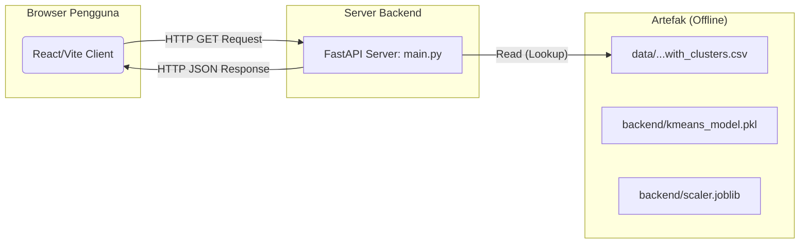

# Dashboard Analisis Gaya Belajar Siswa MOOC

[](https://github.com/zakizulham/E_Learning_Recommender_System/graphs/commit-activity)
[](LICENSE)
[](https://www.python.org/downloads/)
[](https://reactjs.org/)
[](https://fastapi.tiangolo.com/)
[](https://scikit-learn.org/stable/)
[](https://doi.org/10.7910/DVN/BMY3UD)

Ini adalah proyek end-to-end yang menganalisis perilaku siswa pada platform MOOC untuk mengidentifikasi gaya belajar mereka secara otomatis menggunakan K-Means clustering. Hasilnya disajikan dalam dashboard interaktif yang dibangun dengan React (Vite).


<!-- [Image of the final dashboard application] -->

## Fitur Utama

* **Clustering Perilaku:** Menggunakan K-Means dari Scikit-learn untuk mengelompokkan siswa ke dalam "persona" belajar (misal: "Si Penyelesai", "Si Penjelajah").
* **Feature Engineering:** Mengubah log interaksi mentah (tontonan, page views) menjadi fitur yang bermakna untuk model.
* **API Backend:** Backend **FastAPI** (Python) menyajikan model ML dan menyediakan endpoint untuk frontend.
* **Dashboard Frontend:** Frontend **React (Vite)** yang dinamis untuk memvisualisasikan distribusi cluster dan (opsional) menunjukkan gaya belajar siswa secara individu.

## Tumpukan Teknologi (Tech Stack)

* **Frontend:** React, Vite, Recharts (atau Chart.js)
* **Backend:** FastAPI (Python)
* **Machine Learning:** Scikit-learn, Pandas, Numpy

---

## Arsitektur Proyek

Proyek ini menggunakan arsitektur full-stack sederhana di mana frontend dan backend dipisahkan.



1.  **Data:** Data mentah (`.csv`) dari Harvard Dataverse.
2.  **Training (Offline):** Script `train_model.py` menjalankan feature engineering dan melatih model K-Means. Model disimpan sebagai file `.pkl`.
3.  **Backend (API):** FastAPI memuat file `.pkl`. Saat menerima permintaan dari React, ia mengambil data, melakukan prediksi, dan mengirimkan hasil sebagai JSON.
4.  **Frontend (Client):** React memanggil API backend, menerima data JSON, dan menampilkannya menggunakan komponen visual (diagram, tabel, dll.).

---

## Cara Menjalankan Proyek

### 1. Prasyarat

* Python 3.9+
* Node.js 18+
* Git

### 2. Setup Awal

**1. Clone Repositori**
```bash
git clone [https://github.com/zakizulham/E_Learning_Recommender_System](https://github.com/zakizulham/E_Learning_Recommender_System)
cd E_Learning_Recommender_System/
```

**2. Unduh Dataset**
* Unduh dataset MARS dari [Harvard Dataverse (doi: 10.7910/DVN/BMY3UD)](https://doi.org/10.7910/DVN/BMY3UD).
* Buat folder `data/` di root proyek Anda.
* Letakkan file `users.csv`, `items.csv`, `explicit_ratings.csv`, dan `implicit_ratings.csv` ke dalam folder `data/`.
(Struktur folder: `data/users.csv`, dst.)

### 3. Setup Backend (Python)

```bash
# Masuk ke folder backend (sesuai struktur repositori)
cd backend/

# Buat dan aktifkan virtual environment
python -m venv venv
source venv/bin/activate  # (Di Windows: venv\Scripts\activate)

# Install dependensi
pip install -r requirements.txt

# Latih model ML
python train_model.py
# Ini akan membuat file 'kmeans_model.pkl' di dalam folder backend
```

### 4. Setup Frontend (React)

```bash
# Buka terminal baru, dari root proyek, masuk ke folder frontend
cd frontend/

# Install dependensi Node.js
npm install
```

### 5. Menjalankan Proyek

Diperlukan dua terminal yang berjalan secara bersamaan.

**Terminal 1: Jalankan Backend API**
```bash
# Dari dalam folder /backend, pastikan venv aktif
uvicorn main:app --reload
# API akan berjalan di [http://127.0.0.1:8000](http://127.0.0.1:8000)
```

**Terminal 2: Jalankan Frontend React**
```bash
# Dari dalam folder /frontend
npm run dev
# Aplikasi akan terbuka di http://localhost:5173 (atau port lain)
```

---

## Lisensi

Proyek ini dilisensikan di bawah [MIT License](LICENSE).

## Sumber Data & Apresiasi

Proyek ini tidak akan mungkin terjadi tanpa dataset yang luar biasa dari:

> Hafsa, Mounir, 2022, "E-learning Recommender System Dataset", Harvard Dataverse, V2, https://doi.org/10.7910/DVN/BMY3UD